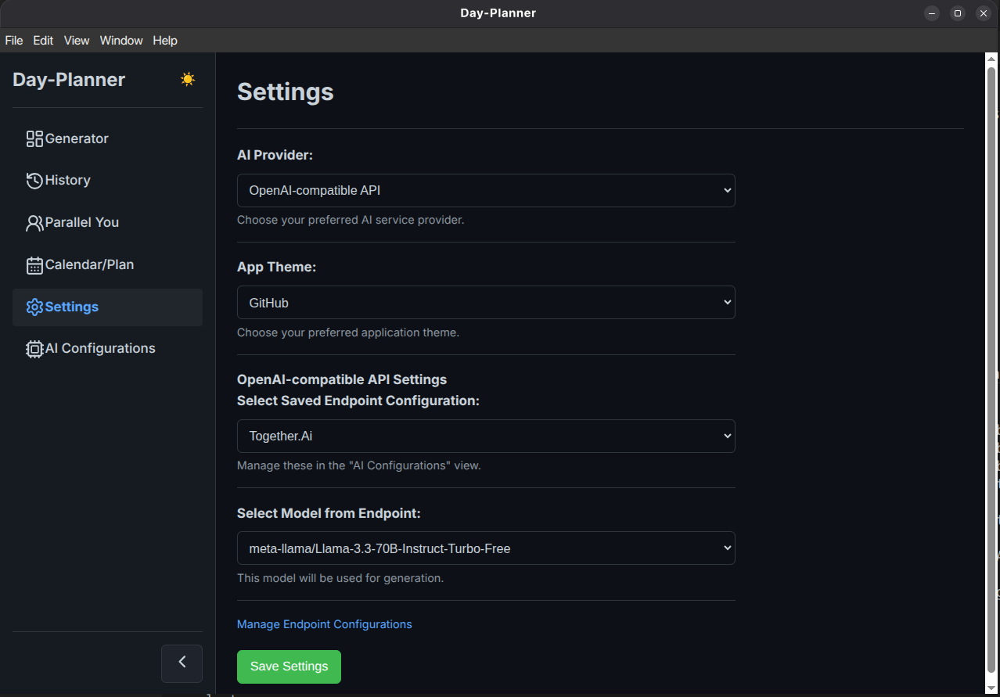
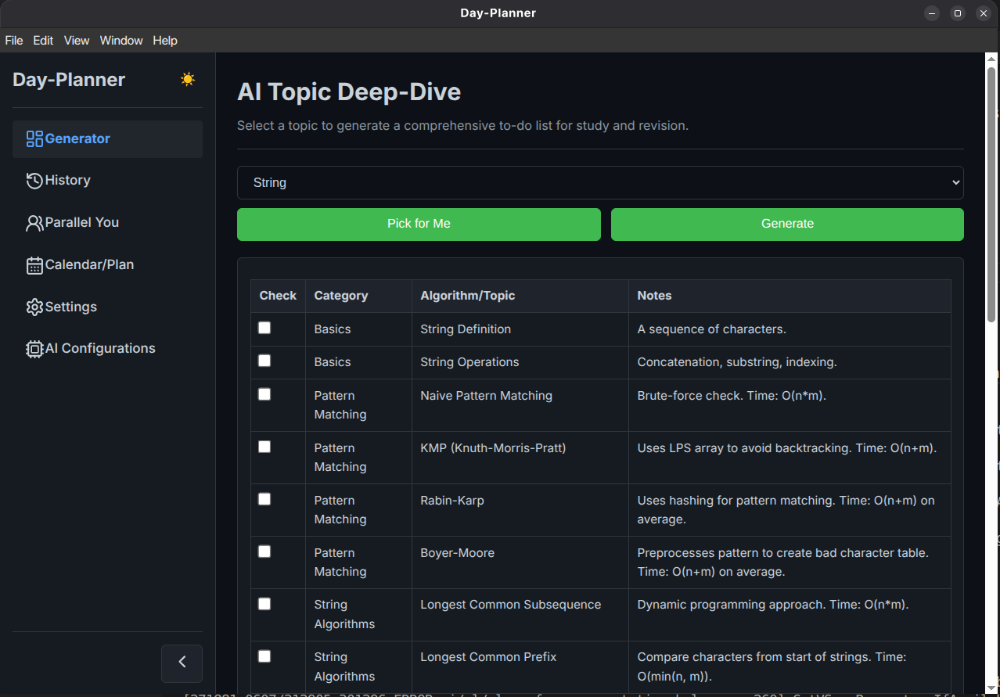

# Day-Planner

An AI-powered desktop application for generating detailed to-do lists and study plans, with calendar integration, history tracking, and user-configurable settings. Built with Electron.

<!-- 
## Screenshot (Placeholder)
 
(Replace placeholder.png with an actual screenshot of the application)
-->

## Features

*   **Flexible AI-Powered Generation:**
    *   Generate comprehensive, Markdown-formatted to-do lists and study plans.
    *   Supports **Google Gemini API** and **OpenAI-compatible APIs** (e.g., for local LLMs via OpenRouter, Jan.ai, LM Studio).
*   **Customizable Topic Input:** Select from a predefined list of topics or enter a custom topic for to-do list generation.
*   **History Tracking:**
    *   Automatically saves all generated to-do lists with their completion states.
    *   View past to-do lists.
    *   Add and save personal notes to each historical entry.
    *   Interactive checkboxes within historical to-do lists with persistent state.
    *   Search functionality for history.
    *   Option to clear all history or **delete individual history entries**.
*   **Enhanced Dashboard:**
    *   Visualizes "To-Do Lists Generated per Topic" (bar chart).
    *   Displays "Overall Task Completion" percentage and progress bar.
    *   Shows "Task Completion Rate per Topic" (bar chart).
    *   Adapts to light/dark mode.
*   **Custom Calendar & AI Study Planner:**
    *   Full monthly calendar view with navigation (previous/next month, today).
    *   Manually add, edit, and delete personal events/tasks on the calendar with persistence.
    *   **AI-Driven Study Plan Generation:** Input a main topic/goal and a date range to have the AI generate a structured study plan, which is then automatically added to your calendar.
    *   Distinct coloring for manually added events (blueish) and AI-generated plan events (yellowish).
    *   Truncated event titles on the calendar grid for better readability, with full details in the event modal.
*   **Modern User Interface:**
    *   Todoist-inspired design.
    *   Collapsible sidebar for navigation (defaults to expanded, state is saved).
    *   Responsive layout.
*   **Themes:** 
    *   Light and Dark mode support, with user preference saved.
    *   Includes a variety of popular themes: Default (Red), Ocean Blue, Forest Green, Graphite Gray, Sunset Orange, Royal Purple, Teal Aqua, Ruby Red, Goldenrod Yellow, Magenta Rose, **Solarized (Light/Dark)**, **Nord (Light/Dark)**, **Dracula (Light/Dark)**, **Monokai (Light/Dark)**, **Gruvbox (Light/Dark)**, **Tomorrow Night Blue (Light/Dark)**, **One Dark Pro (Light/Dark)**, **Material Palenight (Light/Dark)**, and **GitHub (Light/Dark)**.
*   **Parallel You - Dream Pods:**
    *   Create "Dream Pods" to simulate conversations with your future self (from 2029) about your life goals.
    *   Initial message and subsequent chat responses are AI-generated.
    *   Supports both **Google Gemini** and **OpenAI-compatible APIs**, configured via the main application settings.
*   **User Settings (Multi-Provider Support):**
    *   Choose your AI provider: Google Gemini or OpenAI-compatible API.
    *   **For Gemini:** Configure your API Key and select/specify the model name.
    *   **For OpenAI-compatible:** Configure the API Base URL, an optional API Key, and the model name.
    *   All settings are saved locally.
*   **User Feedback:** Non-intrusive toast notifications for actions and errors.
*   **Cross-Platform Potential:** Built with Electron, enabling packaging for Linux, Windows, and macOS (currently configured for Linux .deb).

## Tech Stack

*   **Electron:** For building the cross-platform desktop application.
*   **Frontend:** HTML, CSS, Vanilla JavaScript.
*   **Node.js:** For the Electron main process and backend API interactions.
*   **AI Integration:**
    *   Google Gemini API (via `@google/generative-ai` npm package).
    *   OpenAI-compatible APIs (via Node.js `https` module for direct HTTP requests).
*   **Charting:** Chart.js (for the dashboard).
*   **Markdown Parsing:** Marked.js.

## Prerequisites (for Development)

*   [Node.js](https://nodejs.org/) (which includes npm). It's recommended to use a recent LTS version.
*   An API Key for your chosen AI provider:
    *   For Google Gemini: Obtain one from [Google AI Studio](https://aistudio.google.com/app/apikey).
    *   For OpenAI-compatible APIs: This depends on the service (e.g., OpenRouter key, or none if using a local server without auth).

## Setup and Installation (for Development)

1.  **Clone the repository (or download the source code):**
    ```bash
    # If using Git
    git clone <repository-url>
    cd day-planner 
    # Or simply navigate to the project directory if you downloaded the source
    ```

2.  **Install dependencies:**
    Open a terminal in the project root directory (`day-planner`) and run:
    ```bash
    npm install
    ```

3.  **Configure API Key:**
    *   **Option 1 (Gemini - Recommended for Development):** Create a file named `.env` in the project root directory (`day-planner/`). Add your Gemini API key to this file if you plan to use Gemini primarily during development without initial in-app setup:
        ```
        GEMINI_API_KEY=YOUR_ACTUAL_GEMINI_API_KEY_HERE
        ```
        This `.env` key acts as a fallback if no Gemini key is set in the app's settings.
    *   **Option 2 (In-App Settings - Required for OpenAI & Preferred for Gemini):** Run the app once and configure your chosen AI provider (Gemini or OpenAI-compatible) via the "Settings" view. This is the primary way to set API credentials and endpoints.
        *   For Gemini: Enter API Key and select/specify model.
        *   For OpenAI-compatible: Enter Base URL, API Key (if any), and Model name.

## Running the Application (for Development)

To run the application in development mode:
```bash
npm start
```
This will launch the Electron application window.

## Building the Application (for Distribution)

To build distributable packages (currently configured for Linux `.deb`):
```bash
npm run dist
```
The packaged application will be found in the `dist/` directory. For example, `dist/day-planner_1.0.0_amd64.deb`.

You can install the `.deb` package on Debian-based systems (like Ubuntu) using:
```bash
sudo dpkg -i dist/day-planner_1.0.0_amd64.deb
# If there are dependency issues, run:
sudo apt-get install -f
```

## Using the Application

*   **Sidebar:** Use the sidebar on the left to navigate between different views: Generator, History, Parallel You, Dashboard, Calendar/Plan, AI Configurations, and Settings. The sidebar can be collapsed/expanded using the toggle button at the bottom.
*   **Generator:**
    *   Select a predefined topic from the dropdown or choose "Other (Specify below)" to enter a custom topic.
    *   Click "Generate" to get an AI-generated to-do list using your configured AI provider.
    *   Use "Pick for Me" to have a random, non-completed topic selected.
    *   Download the generated list as an Obsidian-compatible **Markdown (.md) file**.
*   **History:**
    *   View all previously generated to-do lists.
    *   Search history by topic.
    *   Click on an item to view its details, add/edit notes, and interact with its checkboxes (progress is saved).
    *   **Delete individual history entries** or clear all history.
*   **Dashboard:**
    *   View "Overall Task Completion" percentage across all lists.
    *   See a chart for "Number of To-Do Lists Generated per Topic".
    *   Analyze "Task Completion Rate per Topic" with another chart.
*   **Parallel You:**
    *   Click "Start a New Dream Conversation" to define a life goal for 2029.
    *   The AI, acting as your future self, will generate an initial message.
    *   Click on a pod to open a chat view and continue the conversation with your future self.
    *   Pods are saved locally and can be deleted.
*   **Calendar/Plan:**
    *   View a monthly calendar. Navigate with "Prev," "Next," and "Today" buttons.
    *   Click on a day to add a manual event. Click an existing event to edit or delete it.
    *   Use the "AI Study Plan Generator" section: enter a main topic, start date, and end date, then click "Generate AI Plan." The AI will create a structured plan and add it to your calendar.
*   **Settings:**
    *   **Choose AI Provider:** Select between "Google Gemini" and "OpenAI-compatible API".
    *   **Gemini Configuration:** If Gemini is selected, enter your API Key and choose/specify your Gemini model.
    *   **OpenAI-compatible Configuration:** If OpenAI is selected, choose a pre-configured endpoint (managed in "AI Configurations" view) and then select a model from that endpoint.
    *   **Theme Selection:** Choose from a variety of built-in themes.
    *   Click "Save Settings." These settings will be used for all AI interactions.
*   **AI Configurations:**
    *   Add, edit, or delete endpoint configurations for OpenAI-compatible APIs.
    *   Each configuration includes a name, Base URL, an optional API Key, and a list of available model names.
*   **Dark Mode:** Toggle between light and dark themes using the 🌓/☀️ button in the sidebar header.

## License

This project is licensed under the ISC License. See the `LICENSE` file (if one exists) or `package.json` for more details.

## Author

Gaurav Anand
gauravanand809@gmailcom
